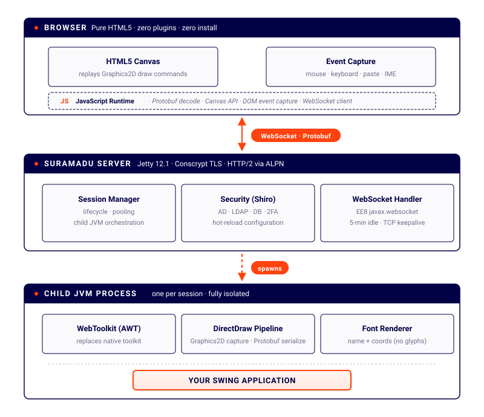

<div align="center">

# Suramadu 26.4.5

### Swing in the Browser

[](https://github.com/manticore-projects/suramadu/actions/workflows/Gradle.yml)
[](https://github.com/manticore-projects/suramadu/releases)
[](https://openjdk.org/)
[](https://nodejs.org/)
[](https://www.gnu.org/licenses/agpl-3.0)
[](https://gradle.org/)
[](https://github.com/manticore-projects/suramadu)

<br/>

*Run any Java Swing application inside a modern web browser — pure HTML5, zero plugins, zero client-side installation.*

<br/>

[Getting Started](#getting-started) · [Build](#build-instructions) · [Upgrading](#upgrading-from-the-webswing-named-releases) · [What's New](#whats-new) · [Architecture](#architecture)

---

</div>

## Overview

**Suramadu** renders Java Swing applications into an HTML5 Canvas and delivers them to any browser over a WebSocket. Your application runs unchanged on the server; the browser only draws the window.

The project is a fork of **WebSwing v20.2.5**, the last release published under the GNU AGPL v3. It is maintained by [Manticore Projects](https://manticore-projects.com) to keep that codebase running on current JDKs, with a focus on modern JDK compatibility, security hardening and build toolchain modernization.

> **Suramadu is not affiliated with, endorsed by, or supported by Webswing Limited or Webswing s.r.o.**

### About the name

The [Suramadu](https://en.wikipedia.org/wiki/Suramadu_Bridge) is the bridge that crosses from Java to the island of Madura — 5.4 km of cable-stayed span across the Madura Strait, first proposed in the 1960s and finally opened in 2009. It seemed a fitting name for software whose whole job is carrying Java across to somewhere else.

### Source availability

Suramadu is licensed under the GNU AGPL v3. If you interact with a running instance over a network, you are entitled to the complete corresponding source of that instance under section 13 of the licence.

The complete corresponding source for every released version is in this repository. Releases are tagged; deployed instances link back here.

---

## What's New

### JDK Compatibility

Recommended standard OpenJDK distributions: [Eclipse Temurin](https://adoptium.net/), [BellSoft Liberica](https://bell-sw.com/pages/downloads/), or [Amazon Corretto](https://aws.amazon.com/corretto/).

| JDK |    Status    | Temurin Support | Notes                                                     |
|:---:|:------------:|:---------------:|:----------------------------------------------------------|
| 17 (LTS) | 🔶 Supported | Oct 2027 | Toolchain of the build                                    |
| 21 (LTS) | ✅ Supported  | Dec 2029 |                                       |
| 23 | ✅ Supported  | ⛔ EOL (Mar 2025) | Non-LTS, 6-month lifecycle                                |
| 25 (LTS) | ✅ Supported  | Sep 2031 | Current LTS                                               |
| 26 | ✅ Supported  | Sep 2026 | Non-LTS; requires `--sun-misc-unsafe-memory-access=allow` |

All internal APIs adapted for the post-JDK-11 module system — no `--illegal-access=permit`, no `-noverify` required.

**Beware:** JetBrains Runtime modifies AWT's internal keyboard focus dispatch, which breaks when the toolkit is replaced. Mouse events are unaffected because they bypass the patched focus path.

### Demo

Try the [Online JSQLFormatter running on Suramadu](http://jsqlformatter.manticore-projects.com/jsqlformatter/demo.html?args=-c%20OoSQKgEgBApgHlAggZSgCgFBWz7yCiAMvgMJhQBUWuOAYgEoDyAslAMYBmMAdAE4wAHAPrwoASmrYANFA5xeSVJho4CxMtgCWAEyFsArr34A7NgE8hHXgHsAtpJWOZc3gEMALjAe4GLdndtrY24XDxghAAsAZ3dvHGAIfHp8dCgdPUMTc0sbWxl0gyMYUwtNY3drGQA3VwAbfXDtMPEoEAA5VLwiUnI03UKsiys7OMcx8YnJqencfP7M4uyyitGZtfWNyZlmVzg0WXluGvrG5rEoY4ahJs9VzfuHx19WNgCgkPkwyJiD3jvHgGA1ptNpJKAAKUY7XYXD4ghECHg-yBKMejA6LiOdSuNxgUAAPABeWBwLEna5hZGo6ljADiTAAqgAFKAAIQAmrgCgsSjkRjSBdS5hkirzltZxFTEG0ACJ9EWDITiqDEgBcrMYjAA0kISAz6Mk2iR2asGW0QOikIRCKs1D1sOrNTq9Qb8EaTesZABGVbPKDafR1SWzfy1WpCdxmAQwKKKdC27oaAD0FAA1FAZfQQAA1dq0oTIcD4NCIc4UJNUqhjP2vWyBYKvMNhNzhyPRqCuKntUH0CFQjr7VSJ8g7Pbyxu1Zt1CNR8L8DgtArWJueFsz6NCedU9Y1t4N5eT1fTtteGkJJIpdIxDz6WPQ-YAchID5kD4gD+D1PpjGZbM5S5XGA1xPT9NgZQs2lpVIAMPIDj1nTcYAXc4JDtDRQ1qbgl30cogIEVxeEjVYZDYARuFeHDV3wwiLG0GM2GIjCsP6A8p1qRiJ2YvRWKPVtZygAAfASoA-NAIBIVURME4SwGsXUIgI-YJ3XGNuAUzReAydxKCgL0AAY9NfABOEzuAMj8JGmISRIAUnED8YLYlSOIPcieLg8M6KiBixhkVwBAEXguInNjx3ctd-MC1xNCiOpGMioL0gS6LYvDLdfI7AKgsuID4qyskcWaZKYunXE8sCgrTluaZ02Uk8ojhS4PE0IIhGjXgWu0C46nSSjNHYjKErhABzGLVxgXQcvKoKOGizSpoykhrDqeiYH2IbZo0oQcpkPTQImChfg+NxPFkObtuxcIACMfKcTKKo4axeDYCahFS8IFruoaomKFrNLoq73Ciabgp5cwQbKKJDFywb8shwxXFMcJXECSiIfmUUlmMKG3CRiHsYRpGEQEDTaMpDL9jQ8hkH0Wx1u4FGnvcGLXteGJrg0yMhBu-bqyYF5YX4YQODKIRXCiH6ge4sMO23HBuzBSFoU4HhIfcXhaeKdxpdglsoCuuWVEtVwuLVjXbC1lV9dN7H1c18oqXPZJrcc3irc412PJaK7rGsABrC7yRuxjKeHKAabpjsGdR8odMxUJTssyY-SRdYFd7JWOhVrDbc05T+FeKogIsaJtM7B5LXgSqKVO4kTeOdIyrTkFFf7GEeBC3jEIXA2K46E3PbXecrau4LwundLAWlOVR8HoNiQ9ljAJbQ3gR7PtoRcVfcGN0HMbMK3MW5fe+VsFo6lqaw2DCJfdenHLudulQZFD9RyEIMbXGG4b6fSM37e0tZD8L4oAkAiLwfY+kWjWTARA3SABmFoScASgEgNCb8v40CMHoDKMEHIo5-1zgA5B4wayC3hCLYwYsJYwClhOWWzd16Z3bjnGI5stY61Cr3e4u9CFsIASPG2-CLYOymE7FIJtGaERZixdm2hOYHwAITEj0mZPSq9p4u1vqFBerk561BaCgKAP1CivXFpLYGi0UD4EdokDo+AAAaIBkBgCUEON+ult7J35iw-+Ijtady9uXQUa9W7K3IcLUW5jaFRB1vrLxmxeG6D8ZbYks9klEP8Qkx4miB7aLdrosMY9l5xTPIkZ26SFSLCUWqDU2pdT6kNMaXmkxIBuhEuyB8VIiAEBEm0LpUw3RyhMdDWJchqEWMYiQaxtj2mOOca4zo4cw4+hpGQ1WmSOGBL1sEwU6cN5ZwiZYKJNC6EHniSEmgSSlSbNjmkoRdssmXLGLk4pd8DGFMwvo7JYxxFaO4pRPCBFIxQGUUxbCuFeDURBSQqYbSOgPk6d0wgvSHz9O6bKYxMBTGxPgbwXQ0LNAximTMsRdj7rZUujXPEzioBtAZNaVe8KRLtBICwJkxAwD4AGZMc8-d8oP1xFAWqB4VINX4E1ZmrV2qdQJCSauTc1jMofI4pkIBkgyh5RMHpKR6WMsGZi687hbwYBTnABwL9lkeJTOmTMOY8wFiLCWMsFYph5M4V3SeExhTbNKVsMKJS+LRipDIWS8lFL+noh1AQUrjAtF9Z5eiIawqAqhcCswyarzuBvJY-1vUfqaQmpoCofwpgyH0AIXEEZNAW2vLYAQvofEdSiH7NygaGGTH2cwwcXQPGjn2Po7ui58keW7j8p4TaYqtoTeOlQfys05uBKkJ8IC3wWVnTQDBLJ8H6JaTMcCeZoIjqHkhPdUAzQWg6IgfVjgqZQBtRmLMuZIKOq5c6ygrrJjuoTWOstBDj1+u9f+j1o6TzJrDWAiNJsvJsGjbG+N49E3eWTd+6wqboUZr-e6o1JqsNcVvEBEQ8iS0oe4BWqtzNa3ZvrY2vwzbp2IY7RMLtbce1WvtP2gN7yh3nEHV6lEfp6NtveRu3A87dA4bvAOESiBV2arPQ8Ldf4uOhVhWsA9kEj0gZPchKkxBaDkGYUJhNFy1jXJM-c75DxNGVMk0ux8z5XzvjPX8ypP7h60r1YQBDYYHD6cM6x9jyY0yPvtS+wsb7SwfuyRCqi6bsmhrkpBuBMG4MtTjecCikKMPXCTTuSdLa3LofTUxjYLH7y4DvZx2LQKaI8ZTdl9Nv7nnYEE1OorjWaKid5eUy8Ens3Gqk8uxzIlnNqcFEpndLFis0QU-cDTUEB3Tc61zYeKF2ANrGJaReAKVsHwXmRGraauu4H8wc1IPa70Prtc+-MEXixRfLButziGN1+S4sVVKzWASJfDXAnKChzgA7e1HQV5NAQyH4KNGIQFXqfR+2dLa8PHjOCei9CTK1A4NBBz9Ywf1cuA1zQj4+gwQcQYUnA+G-BAdpAJtTkHVPEYvTFjHWIQIfVg1KHTpnp4Ie05xjz4mpNqXZLa4Vz7QZdmPHKx0YzjHuGonM4hodlmANpSQhumXSygu9Be4G7rCPOP1ypUK84thdhY6qrzlrPgCutolwYqXNuaBa7l+2hXzvxhK8DSr-57mNee-iL14DdmKsrqc+uwP2BJucj1+8+NBuoCWjjzo9gby2KJ9wK8sHtc0-m7gJbkXQItdsbvfrL06feKZ-uH5CvOfrdR+flAarugHf1aSllFKE8A9R7F-bzvJVHerMb-LFuGc25u-j1dYfI+rn9wr3x09aSF9q++57v5rgV9vQG7eezIkRtrrmy1mzW-Q-SfD6NyPUeY+4Gn5Xjy1eEeb4VWcf0ifLTaHv3rVX2nAMCk0Z-vXu7NwPnoXoqoKAAR9gPl9sPHXFAVFIPmvusBvlxGfsNqumNufFlNklrlvECMbHDBjIMIfIcCTtUqfGettnomrlbENFZjgGdswnVLOETnPuCqviBJ8mKl-vBMGgANxAA$$) 


### Features

- **Truly headless operation on Linux** — no X server, no Xvfb, no virtual framebuffer. AWT initialises against an `--patch-module`–injected `GraphicsEnvironment` + `FontManagerFactory` that bypass `libawt_xawt.so` entirely. A `*-jre-headless` JDK package is sufficient; container images shrink accordingly.
- **Shiro Security Plugin** with hot configuration reloading provides authorization via AD/LDAP/Database/Text Files with or without 2FA (Second Factor authorization)
- **SVG Application Icons**
- better server start scripts supporting SSL certificate registration and WAR version numbers
- Deduplication of the java libraries in the WAR file, reducing the size drastically
- **Network resilience** for flaky corporate VPNs (Netskope, Zscaler) — HTTP/2 via ALPN, Conscrypt TLS (tolerates underscored SNI hostnames), per-socket TCP keepalive, 5-minute idle timeouts, TLS session resumption, tuned thread pool with `LowResourceMonitor`

### Build & Runtime Modernization

- **Node.js 24 LTS** — migrated from Node 10; Webpack 5, TypeScript 5, Dart Sass
- **Gradle build system** — fast, incremental builds
- **All dependencies updated** — Jetty 12, Jackson 3, Guava, Log4j2, SLF4J 2.0, Apache Commons, Protocol Buffers, LZ4, and more

### Performance

- **SSE/AVX-optimized PNG encoding** via [zpng-java](https://manticore-projects.com/FPNG-Java/index.html) — hardware-accelerated image compression in the DirectDraw rendering pipeline
- **Browser-side font rendering** — text is rendered as font names + coordinates instead of server-side glyph bitmaps, reducing WebSocket bandwidth by up to 80%
- **GZIP/Brotli pre-compression** for all static assets (reducing the JS size from 5 MB to less than 1 MB), GZIP compression for all content (JSON)

### Security

The fork is hardened for the deployments it was built for.

[](https://snyk.io/test/github/manticore-projects/suramadu)
[](https://github.com/manticore-projects/suramadu/actions/workflows/semgrep.yml)
[](https://semgrep.dev)

**Continuous monitoring** via Snyk (dependency CVEs), Semgrep (SAST/OWASP Top 10), SpotBugs (bytecode analysis), and Codacy (code quality). CycloneDX SBOM generated with every release.

**Proactive hardening** against entire vulnerability classes — not just known CVEs: deserialization allowlists (CWE-502), SSRF scheme validation (CWE-918), XSS content-type enforcement (CWE-79), Zip Slip / path traversal protection (CWE-22), log injection sanitisation (CWE-117), AES-CBC→AES-GCM migration, and HMAC-signed file identifiers.

**Runtime** — non-root Docker container on Eclipse Temurin JRE 21 (Ubuntu Noble), multi-stage build excluding source and build tools from the image.

**Supply chain** — CycloneDX SBOM output supports transparency requirements under NIST SP 800-218 and the EU Cyber Resilience Act.

---

## Getting Started

### Prerequisites

| Component | Version |
|-----------|---------|
| JDK | 17 or later (21+ recommended; [Eclipse Temurin](https://adoptium.net/)). A **headless** JDK distribution is sufficient on Linux servers — see below. |

**No X server, no Xvfb, no virtual framebuffer required.** Suramadu 26.4.5 runs truly headless on Linux via `--patch-module java.desktop` replacements for `GraphicsEnvironment`, `PlatformGraphicsInfo`, and `FontManagerFactory`. The standard `*-jre-headless` package from your distribution (or any JRE/JDK without the GUI dependencies) is enough. `DISPLAY` is explicitly unset by the startup script; nothing in the child Swing JVM ever calls into `libawt_xawt.so` or attempts a display connection.

### Quick Start

```bash
# Download the latest release
curl -LO https://github.com/manticore-projects/suramadu/releases/latest/download/suramadu-26.4.5.zip
unzip suramadu-26.4.5.zip
cd suramadu-26.4.5

# Start the server
./run.sh start

# Open in your browser
open http://localhost:8080
```

### Management

```bash
./run.sh start      # Start the server (background, with log tailing)
./run.sh stop       # Graceful shutdown (30s timeout, then SIGKILL)
./run.sh restart    # Stop + Start
./run.sh status     # Check if the server is running
```

---

## Build Instructions

### Prerequisites

| Tool   | Version |
|--------|---------|
| JDK    | 21+     |
| Gradle | 8.12    |
| Git    | 2.x     |

> Node.js and npm are **automatically downloaded** during the build — no manual installation needed.

### Build with Gradle

```bash
# Clone the repository
git clone https://github.com/manticore-projects/suramadu.git
cd suramadu

# Full build
./gradlew clean build

# Build specific modules
./gradlew :suramadu-directdraw:suramadu-directdraw-javascript:build
./gradlew :suramadu-server:suramadu-server-frontend:build
```

### Deploy

```bash
# Extract to your deployment directory
unzip build/dist/suramadu-26.4.5.zip -d /opt/suramadu

# Configure your Swing application
vim /opt/suramadu/suramadu.config

# Start
cd /opt/suramadu && ./run.sh start
```

---

## Upgrading from the WebSwing-named releases

Everything a user or administrator touches now carries the `suramadu` name. Everything that would
break a running deployment — system properties, Java packages, the public API — is unchanged.

| | Before | Now |
|---|---|---|
| Distribution archive | `webswing-<version>.zip` | `suramadu-<version>.zip` |
| Web application | `webswing-server-<version>.war` | `suramadu-server-<version>.war` |
| Application configuration | `webswing.config` | `suramadu.config` |
| Server properties | `webswing.properties` | `suramadu.properties` |
| Gradle modules and jars | `webswing-*` | `suramadu-*` |
| Docker image | — | `manticore-projects/suramadu` |
| System properties | `-Dwebswing.*` | **unchanged** |
| Jetty properties keys | `org.webswing.server.*` | **unchanged** |
| Java packages and API | `org.webswing.*` | **unchanged** |

**No action is required to upgrade.** Existing `webswing.config` and `webswing.properties` files are
still read, so an installation created before the rename keeps working untouched. Rename them when
convenient, or leave them. Where both names are present, the `suramadu.*` files take precedence.

Java packages keep the `org.webswing` namespace deliberately: renaming them would break every
deployment that references a class by name, and would require altering the copyright and licence
notices the AGPL obliges us to preserve. They are internal identifiers, not product names.

---

## Architecture

<p align="center">
  
</p>

**How it works:** The server intercepts Java2D `Graphics2D` paint operations in the child JVM, serializes them via Protocol Buffers, and streams them over WebSocket to the browser. The browser's JavaScript engine deserializes and replays the draw commands on an HTML5 Canvas. User input (mouse, keyboard) flows back over the same WebSocket.

---

## Dependency Overview

| Component | Version | Purpose |
|-----------|---------|---------|
| Jetty | 12.1.+  | Embedded HTTP/WebSocket server |
| Jackson | 3.+     | JSON serialization |
| Protocol Buffers | 3.+     | Binary wire format (DirectDraw) |
| Apache Shiro | 3.+     | Authentication & authorization |
| Guava | 33.+    | Core utilities |
| Log4j 2 | 2.+     | Logging framework |
| SLF4J | 2.+     | Logging facade |
| Webpack | 5.+     | JavaScript bundling |
| TypeScript | 5.+     | Type-safe frontend code |

---

## Attribution

Suramadu is derived from WebSwing v20.2.5, the last release published under the GNU AGPL v3. All credit for the original architecture and implementation belongs to its authors.

Suramadu is not affiliated with, endorsed by, or supported by Webswing Limited or Webswing s.r.o.

## License

This project is licensed under the [GNU Affero General Public License v3.0](https://www.gnu.org/licenses/agpl-3.0.en.html).

---

<div align="center">

**Maintained by [Manticore Projects](https://manticore-projects.com)**

*Building enterprise financial software for banks and insurances since 2011.*

</div>